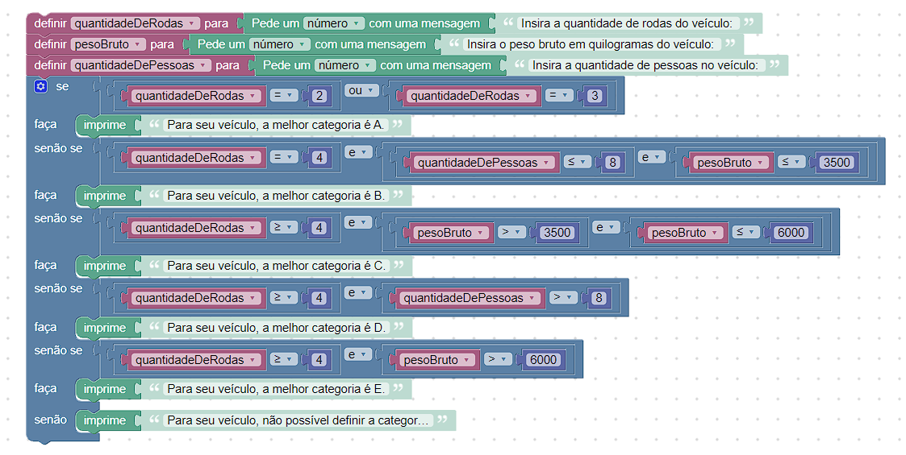

# Instruções: 

## Desenvolva um código, utilizando o Google Blockly, que utilize as seguintes características de um veículo:

- Quantidade de rodas;
- Peso bruto em quilogramas;
- Quantidade de pessoas no veículo.

Com essas informações, o programa mostrará qual é a melhor categoria de habilitação para o veículo informado a partir das condições:
- A: Veículos com duas ou três rodas;
- B: Veículos com quatro rodas, que acomodam até oito pessoas e seu peso é de até 3500 kg;
- C: Veículos com quatro rodas ou mais e com peso entre 3500 e 6000 kg;
- D: Veículos com quatro rodas ou mais e que acomodam mais de oito pessoas;
- E: Veículos com quatro rodas ou mais e com mais de 6000 kg.




Para acessar :  https://blockly-demo.appspot.com/static/demos/code/index.html?lang=pt-br#x6opc4


# Código:

```

var quantidadeDeRodas, pesoBruto, quantidadeDePessoas;


quantidadeDeRodas = Number(window.prompt('Insira a quantidade de rodas do veículo: '));
pesoBruto = Number(window.prompt('Insira o peso bruto em quilogramas do veículo: '));
quantidadeDePessoas = Number(window.prompt('Insira a quantidade de pessoas no veículo: '));
if (quantidadeDeRodas == 2 || quantidadeDeRodas == 3) {
  window.alert('Para seu veículo, a melhor categoria é A.');
} else if (quantidadeDeRodas == 4 && quantidadeDePessoas <= 8 && pesoBruto <= 3500) {
  window.alert('Para seu veículo, a melhor categoria é B.');
} else if (quantidadeDeRodas >= 4 && pesoBruto > 3500 && pesoBruto <= 6000) {
  window.alert('Para seu veículo, a melhor categoria é C.');
} else if (quantidadeDeRodas >= 4 && quantidadeDePessoas > 8) {
  window.alert('Para seu veículo, a melhor categoria é D.');
} else if (quantidadeDeRodas >= 4 && pesoBruto > 6000) {
  window.alert('Para seu veículo, a melhor categoria é E.');
} else {
  window.alert('Para seu veículo, não possível definir a categoria.');
}


```